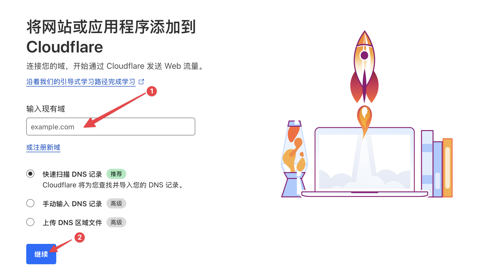
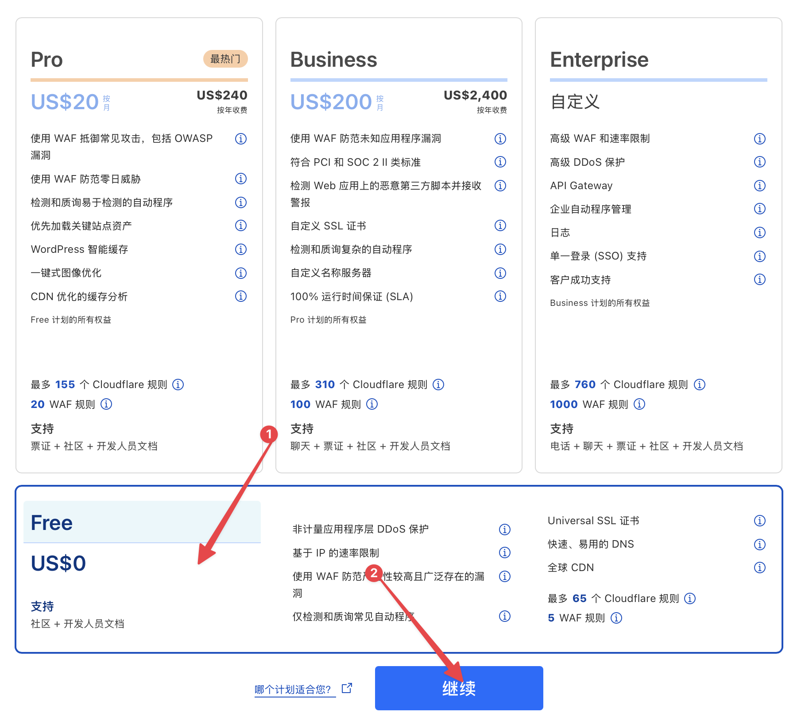
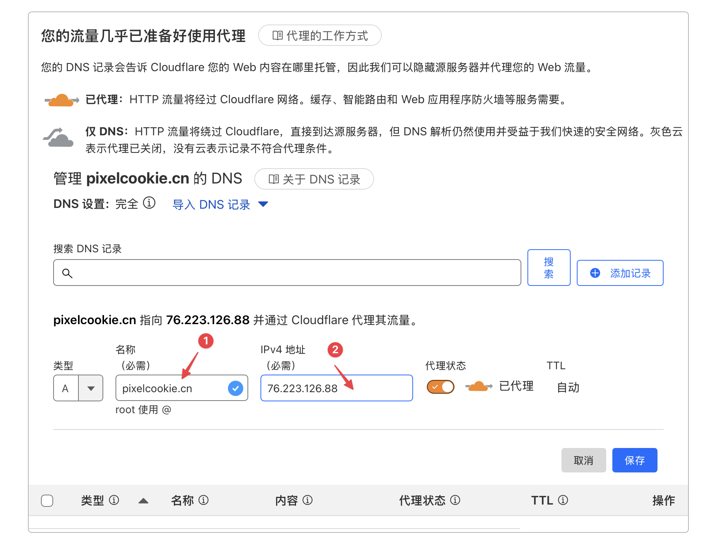
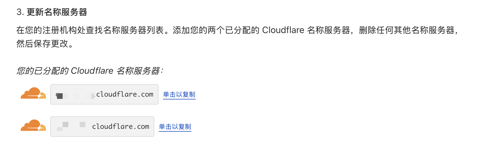
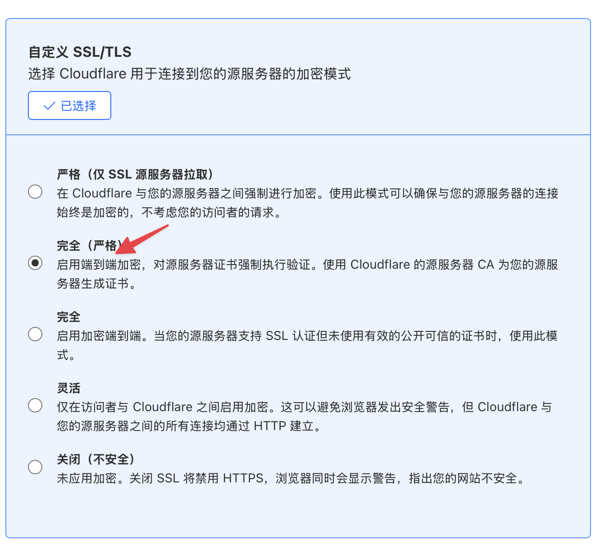

# Vercel 国内域名加速指南

Vercel 是一个强大的云服务平台，支持静态和动态网站的部署、预览及上线。如果你曾使用过 GitHub Pages，那么 Vercel 的操作流程对你来说会很熟悉。通过将 GitHub 与 Vercel 集成，你可以在推送代码或合并 PR 时自动部署项目，而无需担心服务器的管理问题。这使得 Vercel 成为个人项目（如个人博客、AI 聊天应用等）的理想选择。使用 Vercel 搭建个人博客有以下几个显著优势：

- **简便的部署流程**：Vercel 提供与 Git 的无缝集成体验，只需将代码推送到 GitHub 等仓库，Vercel 即可自动部署最新代码。无需手动配置服务器或环境，既方便又高效。
- **全球加速**：Vercel 的 CDN 覆盖全球，用户可以在世界各地快速访问你的博客。这对需要全球访问的个人博客尤为重要，尤其是对注重访问速度和用户体验的用户。
- **自动性能优化**：Vercel 默认进行代码压缩、图片优化等性能优化，减少资源占用，提高页面加载速度，无需额外配置。
- **多种前端框架支持**：Vercel 对多种前端框架（如 Next.js、React 等）提供良好支持，适合构建交互性更强的个人网站或博客。
- **自定义域名与 SSL**：Vercel 支持自定义域名绑定，并免费提供 SSL 证书，确保网站的安全性和可靠性。
- **可扩展性与多样化功能**：Vercel 提供 Serverless Functions，轻松添加后端功能，如 API 服务，适合需要动态内容或交互的博客网站。

这些优势使 Vercel 成为搭建个人博客的理想平台，特别适合希望拥有快速、稳定且无需繁杂运维的用户。然而，在国内访问 Vercel 部署的项目时，常常会遇到无法直接访问的问题，这时就需要科学上网。但如果你希望向不具备科学上网能力的亲朋好友展示你的博客，该怎么办呢？下面将详细介绍如何解决这个问题：

## 基础知识

**什么是 DNS？**

DNS（域名系统）就像互联网的“电话簿”：人们访问网站时会输入类似 www.example.com 这样的域名，但计算机只识别 IP 地址（如 192.0.2.1）。DNS 的作用就是将域名转换成计算机能理解的 IP 地址。

**举个例子**

假设你拥有一个网站，域名是 mywebsite.com，托管在 Vercel 上。为了让用户访问这个网站，你需要告诉 DNS 系统如何找到 Vercel 提供的服务器。通会用到 **CNAME** 和 **A 记录**。

**CNAME 记录的用途**

假如 Vercel 给了你一个通用的域名，比如：name-china.vercel-dns.com，可以通过这个域名访问到你的站点。你可以添加一条 **CNAME 记录**：

- **CNAME 记录**：mywebsite.com 指向 name-china.vercel-dns.com

这样，用户访问 mywebsite.com 时，DNS 会首先查到 name-china.vercel-dns.com，然后再解析其 IP 地址，最终访问到你的站点。这种配置可以灵活地让 mywebsite.com 始终指向 Vercel 分配的域名。

**A 记录的用途**

为了进一步优化，有时你会直接获取服务器的 IP 地址（如 76.223.126.88），然后通过 **A 记录**直接指向该 IP，避免每次查询都去找 name-china.vercel-dns.com 的 IP。可以添加一条 **A 记录**：

- **A 记录**：mywebsite.com 指向 76.223.126.88

这样，当用户访问 mywebsite.com 时，DNS 会直接解析到 76.223.126.88，省去一步重定向的时间，访问速度更快。

## 准备条件

- CNAME: xxxxx.vercel.app（这里就是 Vercel 本身提供的那个网址）
- A 记录: （可选）假如你有的话
- 从阿里云（或其他域名注册网站）注册一个心仪的域名
- 注册 Cloudflare

## 具体步骤

1. 将准备好的国内域名加入 Cloudflare Websites，并选择免费计划。

   
   

2. 在“名称”处填写你的域名，在“IPv4”处填写 "76.223.126.88"，并保存。假如只有 CNAME，那就选择 CNAME，名称写自己的域名，内容写 xxxxx.vercel.app；然后再添加一个新的 CNAME，名称写 “www”，内容还是 xxxxx.vercel.app。这第二个添加是为了实现能通过 www.你的域名来访问。

   

3. 将 Cloudflare 分配给你的名称服务器，复制粘贴到阿里云后台的 DNS 修改 - DNS 服务器。修改后，等待 Cloudflare 检查是否完成。

   

4. 完成后，选择 SSL/TLS--概述，配置 SSL -- 完全（严格），否则可能因重定向过多而无法打开。

   

5. 然后返回 Vercel，在 Settings -- Domains 中添加你的域名即可，选择第一个 Recommend 即可。

   